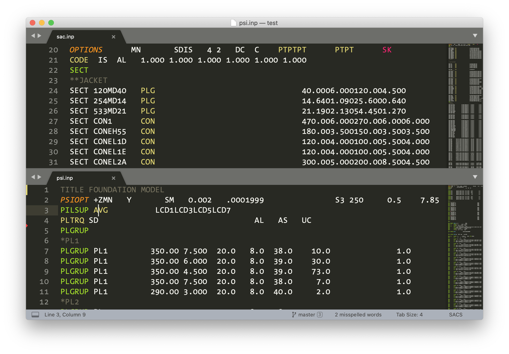

# SACS syntax highlighting for Sublime Text

[SACS] is a multi-purpose commercial computer software for performing linear and non-linear static, and dynamic analysis of space frame structures.

The syntax file `sacs.sublime-syntax` included in this repository [color codes][s] the various parameters used in SACS input files (with `.inp` extension) to help break the monotony of text and improve readability of input file(s). It works with [Sublime Text][st] in MacOS, Windows 10, or Linux. Below is an example of a syntax highlighted input file:

## Installation

Here is how-to install package(s) in Sublime Text:

https://user-images.githubusercontent.com/177423/123505842-d5c62000-d693-11eb-903c-6da7322947bc.mov

### From package control (recommended)

With this package now available from [Package Control][pkg] `sacs_st` can be installed from directly within Sublime Text. Here is how:

1. From _Tools_, select _Install Package Control..._ (skip step if installed)
2. From _Preferences > Package Control > Install Package_, search for `sacs` and select

### Manual method

Download and place the file `sacs.sublime-syntax` under _Packages > User_ folder, which is accessible from _Preferences > Browse Packages..._ menu.

[SACS]: https://www.bentley.com/en/products/brands/sacs
[s]: https://en.wikipedia.org/wiki/Syntax_highlighting "Syntax highlighting"
[st]: https://www.sublimetext.com/ "Sublime Text - A sophisticated text editor for code, markup and prose"
[pkg]: https://packagecontrol.io/packages/SACS
